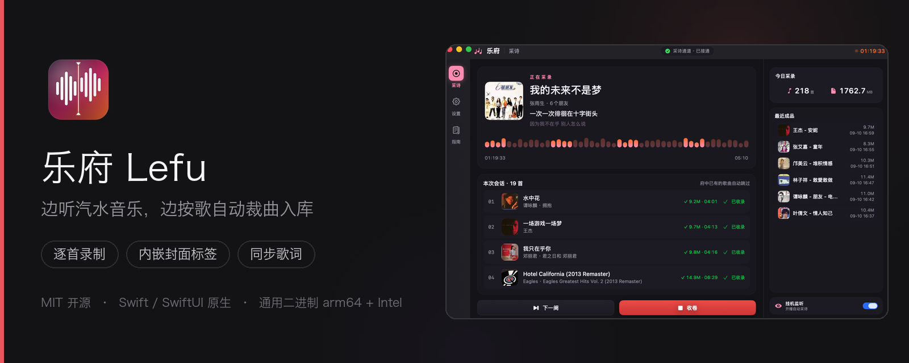
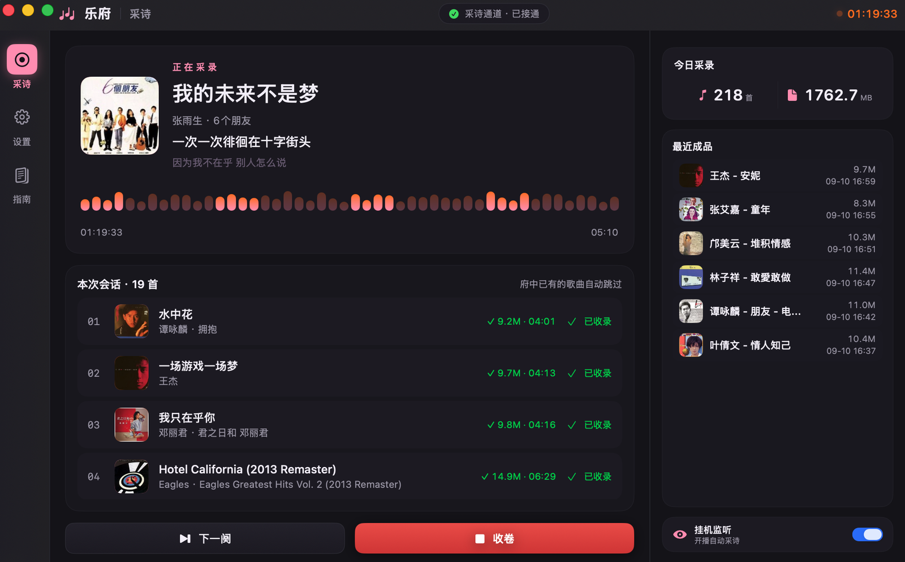
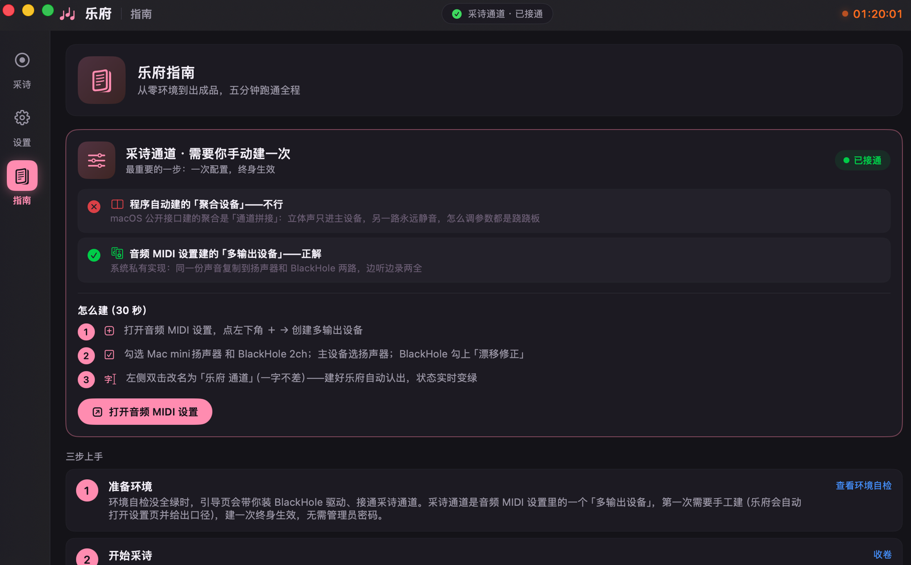

<div align="center">
  
</div>

# 乐府 Lefu — 汽水音乐 / Apple Music / 网易云音乐 / 酷我音乐 / 酷狗音乐 / 喜马拉雅 / QQ音乐 Mac 内录自动裁曲工具

[](https://github.com/boxter007/lefu/releases)
[](LICENSE)
[](#环境要求)
[](Package.swift)
[](https://github.com/boxter007/lefu/stargazers)

**乐府（英文名 Lefu）是一款开源免费的 macOS 应用：在 Mac 上边听汽水音乐、Apple Music、网易云音乐、酷我音乐、酷狗音乐、喜马拉雅或 QQ音乐，边按歌自动录制、裁曲、入库，每首歌自动保存为内嵌封面与标签的 MP3，并附带同步 `.lrc` 歌词文件。** 纯 Swift / SwiftUI 原生开发，无需事后剪辑，切歌即出片，MIT 协议开源。

## 立即开始

| 方式 | 命令 / 链接 |
|---|---|
| 下载安装包 | [Releases](https://github.com/boxter007/lefu/releases/latest) → 下载 `Lefu-v1.0.2.zip`（通用二进制，解压拖入 Applications） |
| Homebrew | `brew install --cask boxter007/lefu/lefu` |
| 自行构建 | 见下方[构建运行](#构建运行) |

三步跑通：装 [BlackHole 2ch](https://existential.audio/blackhole/)（App 内一键装）→ 音频 MIDI 设置里建一次「乐府 通道」多输出设备（30 秒）→ 状态变绿，开始采诗。App 内「指南」页有全程引导。

## 界面预览

| 采诗主界面 | 三步上手指南 |
|---|---|
|  |  |

## 项目信息速览

| 项目 | 信息 |
|---|---|
| 名称 | 乐府（Lefu） |
| 类型 | macOS 音乐内录 / 自动裁曲 / 音乐归档工具 |
| 平台 | macOS 13.0+（Apple Silicon 与 Intel） |
| 技术栈 | Swift 5.9 · SwiftUI · CoreAudio · LAME |
| 内录对象 | 汽水音乐、Apple Music（macOS 自带「音乐」）、网易云音乐、酷我音乐、酷狗音乐、喜马拉雅、QQ音乐（含本地与在线歌曲） |
| 输出格式 | MP3 320kbps（内嵌 ID3 封面标签）+ `.lrc` 同步歌词 |
| 许可证 | [MIT](LICENSE)（开源免费） |
| 变更日志 | [CHANGELOG.md](CHANGELOG.md) |
| 路线图 | [docs/ROADMAP.md](docs/ROADMAP.md) |
| 依赖 | [BlackHole 2ch](https://existential.audio/blackhole/)（App 内一键安装）、LAME（已内置，无需 Homebrew） |

> 乐府，汉代掌管音乐的官署，采民间歌谣配乐入府库。《汉书·食货志》：「行人振木铎徇于路以采诗。」这个 App 做的事一模一样：听歌，采诗，收卷入库。

## 核心功能

- **实时裁歌**：逐首录制架构，切歌瞬间自动分段，一首一收卷，不产生"散落的长录音"
- **歌词四路抓取**：音源本地（汽水 / 酷狗 KRC、酷我 `.lrcx`、喜马拉雅字幕，均逐字）→ 自家缓存 → LRCLIB → 网易云，抓到即存缓存，离线也有
- **挂机监听**：菜单栏常驻，开播自动采诗，停播自动收卷，全程无人值守
- **成品即发布级**：LAME 320k 编码，ID3 封面标签内嵌（系统不上报封面时自动从音源本地补齐，如酷我），成品旁挂同步歌词
- **府库一目了然**：按日期归档，App 内直接看今日成果与最近入库

## 命名词汇表

| 词 | 在乐府里 |
|---|---|
| 乐府 | 本 App |
| 采诗 | 开始录制 |
| 收卷 | 停止录制并交后台流水线 |
| 下一阕 | 手动切下一首 |
| 府库 | 成品输出目录（默认 `~/Music/乐府`） |

## 工作原理

```
汽水音乐 / Apple Music / 网易云音乐 / 酷我音乐 / 酷狗音乐 / 喜马拉雅 / QQ音乐（正常放歌）
      │
      ▼
「乐府 通道」多输出设备（音频 MIDI 设置手工建，一次生效）
      │ 复制同一份声音到两路
      ├──► BlackHole 2ch（虚拟声卡）──► 乐府从这里录
      └──► Mac 扬声器 ──────────────► 你照常听
```

### 为什么多输出设备必须手工建（一次）

macOS 公开接口（`AudioHardwareCreateAggregateDevice`，哪怕带 stacked 标记）程序化建出的"聚合设备"是**通道拼接**：立体声只进主时钟子设备，另一路永远静音，怎么调参数都是跷跷板。音频 MIDI 设置里的"多输出设备"是系统私有实现，才能同一份声音复制到两路。乐府的选择：不 hack 系统私有接口，引导用户在音频 MIDI 设置里建一次（30 秒），终身生效。

### 逐首录制架构

录音频写入 `song-001.wav`，确认切歌后 `capture.rotate(to:)` 无缝换 `song-002.wav`，上一文件交 Cutter 后台流水线（切段 → 歌词 → 编码 → 标签封面 → 入库）。录制与出片全程并行，收卷只是收尾，没有"结束后再集中裁曲"的等待。

## 环境要求

- macOS 13.0+
- Swift 5.9（Xcode 15+ 或 Swift.org 工具链）
- [BlackHole 2ch](https://existential.audio/blackhole/)（App 内可一键下载安装）
- 汽水音乐、Apple Music、网易云音乐、酷我音乐、酷狗音乐、喜马拉雅或 QQ音乐（内录对象）

## 构建运行

**不想自己编译？** 到 [Releases](https://github.com/boxter007/lefu/releases) 下载 `Lefu-vX.Y.Z.zip`（通用二进制，arm64 + Intel 双架构），解压拖进 Applications 即可。每次发布 tag 都由 GitHub Actions 自动构建。

自己构建：

```bash
git clone <本仓库>
cd lefu
swift build            # 日常开发
bash scripts/build_app.sh        # 组装 build/.dist/乐府.app（本机架构）
UNIVERSAL=1 bash scripts/build_app.sh   # 通用二进制（arm64 + Intel，纯 CLT 即可）
bash scripts/install.sh          # 安装到 /Applications 并校验签名
open build/.dist/乐府.app
```

首次启动被 Gatekeeper 拦截（ad-hoc 签名）→ 右键 App → 打开；或 `xattr -cr build/.dist/乐府.app`。

首次使用跟着 App 内「指南」页走：装 BlackHole → 建多输出设备「乐府 通道」（一字不差）→ 状态变绿 → 开始采诗。

## 技术要点

- **音频采集**：CoreAudio 直采 BlackHole，WAV 落盘；切歌 `rotate` 无缝换文件
- **裁曲流水线**：WAV 头解析 → 饱和切段（防越界崩溃）→ 静音跳过（峰值 < 满幅 -50dB）→ LAME 320k → ID3v2.3 内嵌封面 → `.lrc` 旁挂
- **放音路由监测**：HAL 系统级回调，用户在音频 MIDI 设置里一动设备，状态实时跟上
- **回调链持有规则**：跨队列回调一律派发块强持有（曾踩坑：`[weak self]` 派发 + 局部变量持有，GCD 块结束同毫秒释放，主队列回调静默蒸发）
- **统一清理通道**：废纸篓被安全管控拦截时降级直接删除，绝不静默丢中间产物

## 常见问题（FAQ）

**Q：乐府是什么？**
乐府（Lefu）是一款开源免费的 macOS 应用，用于在 Mac 上边听汽水音乐、Apple Music、网易云音乐、酷我音乐、酷狗音乐、喜马拉雅或 QQ音乐边按歌自动录制裁曲，每首歌自动保存为内嵌封面标签的 MP3 并附带同步歌词。

**Q：乐府怎么把汽水音乐 / Apple Music / 网易云音乐 / 酷我音乐 / 酷狗音乐 / 喜马拉雅 / QQ音乐的歌曲保存成 MP3？**
乐府通过 BlackHole 虚拟声卡采集播放器的系统音频输出，按切歌点自动分段，每段经 LAME 320k 编码为 MP3，内嵌 ID3 封面与标签，输出到 `~/Music/乐府` 按日期归档。

**Q：乐府免费吗？开源吗？**
免费且开源，MIT 许可证，源码全部在本仓库，可自行构建或修改。

**Q：乐府需要安装什么依赖？**
只需 BlackHole 2ch 虚拟声卡（App 内一键下载安装）。MP3 编码器（LAME）已内置在 App 中，无需 Homebrew。

**Q：为什么需要 BlackHole？**
乐府靠虚拟声卡采集系统正在播放的音频。配合「乐府 通道」多输出设备，同一份声音同时进 BlackHole（录制）和扬声器（收听），边听边录互不干扰。

**Q：乐府支持哪些音乐软件？**
已支持 **汽水音乐**、**Apple Music**（macOS 自带「音乐」）、**网易云音乐**、**酷我音乐**、**酷狗音乐**、**喜马拉雅** 与 **QQ音乐**（本地与在线歌曲/播客均可；Apple Music 广播直播暂未适配）。其中汽水、酷狗、酷我与喜马拉雅支持零联网的本地歌词（汽水 / 酷狗为 KRC 逐字，酷我为 `.lrcx` 逐字时间轴，喜马拉雅为本地字幕文稿，需在 App 内开启「自动打开字幕/歌词」），酷我不上报封面时会自动从本地补齐。采用可扩展的音源架构，后续按需接入更多播放器。接入新音源的方式见 [docs/ADDING-A-SOURCE.md](docs/ADDING-A-SOURCE.md)。

**Q：歌词从哪里来？**
按 音源本地歌词（汽水 / 酷狗 KRC、酷我 `.lrcx`、喜马拉雅文稿，均逐字）→ 自家缓存 → LRCLIB → 网易云 四路顺序抓取，纯器乐或小众歌可能全网没有；联网抓到过的歌会存进缓存，之后离线也有。

**Q：录出来的 MP3 音质如何？**
LAME 320kbps CBR，与源音频同为 44.1kHz 采样率，内嵌 ID3v2.3 封面与标签，旁挂 `.lrc` 同步歌词。

## 已知限制

- 汽水 NowPlaying 的 `elapsed` 恒为 0，半路开始录制时歌曲绝对进度不可知（行内诚实显示 `--:--`）
- Apple Music 广播直播不上报播放速率与总时长，挂机监听不会自动开录（普通歌曲正常）
- 网易云歌词接口无官方保障，接口变动可能影响第四路抓取
- 喜马拉雅本地歌词依赖 App 内开启「自动打开字幕/歌词」；未开启时只能取到已缓存曲目的词，取不到不报错、也不会取错
- QQ音乐本地缓存为加密 QRC，暂未接入本地歌词；QQ 曲目走在线歌词链（LRCLIB / 网易云）
- ad-hoc 签名，无自动更新，迭代靠重新构建

## 依赖致谢

- [LAME](https://lame.sourceforge.io/)（LGPL）—— MP3 编码，随 App 分发 `libmp3lame.dylib`，依 LGPL 2.0/3.0 之授权分发，源码见 [lame.sourceforge.io](https://lame.sourceforge.io/)
- [BlackHole](https://existential.audio/blackhole/) —— 存在性音频的虚拟声卡（GPLv3），由 App 运行时引导用户从官方渠道安装，本仓库不分发其本体

## 参与贡献

欢迎提 Issue 和 PR。动手之前请先读一遍 [CONTRIBUTING.md](CONTRIBUTING.md)。

- **报 Bug**：附上 macOS 版本、使用的播放器（汽水音乐 / Apple Music / 网易云音乐 / 酷我音乐 / 酷狗音乐 / 喜马拉雅 / QQ音乐）版本、复现步骤，以及 `~/Music/乐府` 下的现象说明
- **提功能**：先讲使用场景，再讲你想怎么实现
- **改代码**：从标了 `good first issue` 的 issue 入手最省事

## Star 趋势

[](https://star-history.com/#boxter007/lefu&Date)

## 支持项目

如果乐府帮到了你，**给个 Star** 是最实在的支持——它能让更多在 Mac 上听歌的人找到这个工具。也欢迎把这篇文章转给有同样需要的朋友。

## License

[MIT](LICENSE)
